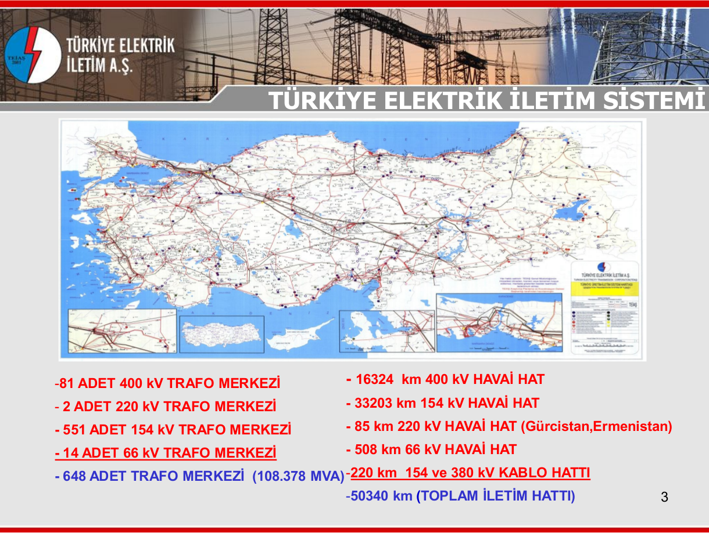

EE361 - Electromechanical Energy Conversion-I
=====
Hi! In this [website](https://www.gitbook.io/book/ozank/ee361),  [I](http://ozan.keysan.me/) will publish my personal course notes for 3rd year EE-361 Electromechanical Energy Conversion-I course (METU, 2014). For more information about the course, please visit the [course website](http://www.keysan.me/ee361).

I'll try to update course notes every week. You can also contribute if you want, using [Github](https://github.com/ozank/ee361). You can contact [me](http://ozan.keysan.me/), if you have any questions.

# Scope of EE361-EE362:
We will cover methods for Electromechanical Energy Conversion(EMEC), which can be in two ways:
* Electrical Energy to Mechanical Energy (i.e. **Motors**)
* Mechanical Energy to Electrical Energy (i.e. **Generators**)

Although, it is not a EMEC device, we will also cover **transformers**, which is a critical component in transmission of energy.

## How the Energy Transferred?
The figure below is a simple representation of energy grid (from source to customers):

The steps include:
- Generation at power plants
- Increasing voltage up to 400 kV with step-up transformers
- Transmission of energy with high-voltage lines
- Decreasing voltage for industrial and domestic users with step-down transfomers.

Domestic users just consume 30% of total electricity generation. Electric motors consume nearly 50% of electricity generation.

## Electric Grid of Turkey

### Electric Generation in Turkey

- Installed Capacity: 61.2 GW
- Max. Consumption: 40 GW (~30 million kettles)
- Annual Generation: 239.500 GWh (6th in Europe)
  - Domestic Usage: ~30%
  - Industrial Usage: ~70
- Per Capita Consuption: 2850 kWh (2010) ([Other Countries](http://data.worldbank.org/indicator/EG.USE.ELEC.KH.PC))

#### Sources of Energy:
* Natural Gas: 43 %
* Coal: 27 %
* Hydro: 25 %

A three-phase 225 MVA, 275 kV power transformer, which weights 241 tonnes (Courtesy of Scottish Hydro)

## Why the Hassle?
So, **why do we need transformers?** Why don't we transmit electric with the same voltage that comes out of the generator?

[Thomas Edison](http://en.wikipedia.org/wiki/Thomas_Edison) thought the same way and he setup a DC transmission system. However, he soon realized he has to install power stations every few hundred meters around the city, because **low voltage electric transmission is expensive and inefficient**. Thus, the cities filled-up with over head lines.

Then, [Nikola Tesla](http://www.gothamcenter.org/blotter/wp-content/uploads/2013/06/Tesla-2.jpg), suggested use of alternating current (AC) tranmission lines, which triggered the [War of Currents](http://en.wikipedia.org/wiki/War_of_Currents). (Reading suggestion: [AC vs. DC](http://blog.batteryquality.com/ac-vs-dc-alternating-current-vs-direct-current/)). After many years of competition between rival companies (Edison even [electrocuted an elephant](http://www.youtube.com/watch?v=VD0Q5FeF_wU)(may be disturbing) to prove how dangerous AC can be), DC transmission system lost the competition and AC became the world's standard for power generation and distribution.

With AC, it is possible to use transformers to step-up the voltage, which means:
- Same power can be transmitted with a smaller current
  - Thinner, cheaper wires can be used
  - Energy can be transferred to long distances with minimum resistive loss ($$I^2R$$)

**Transformers only work with AC**, and you'll learn the reason in this course.

---
 Bu eser <a rel="license" href="http://creativecommons.org/licenses/by/4.0/"> Creative Commons Al 4.0 Uluslararası Lisansı</a> ile lisanslanmıştır.
