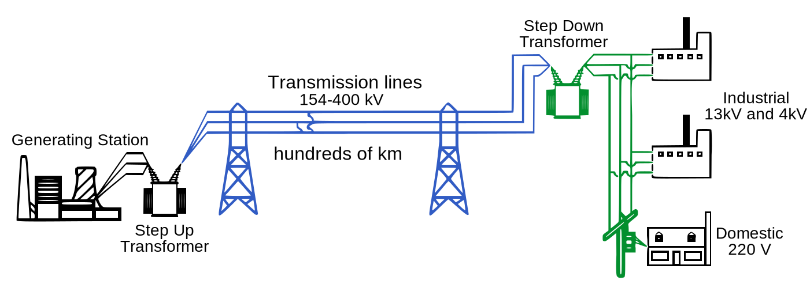
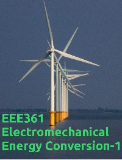

EE361 - Electromechanical Energy Conversion
=====

Course Notes

1 

2 [dene](https://raw.githubusercontent.com/ozank/ee361/master/cover_small.jpg)

3 

8 

4 

5 

sdsadsa

---

Here is the introduction for the quiz

This is Question 1:
- [x] This is the proposition 1 (the correct one)
- [ ] This is the proposition 2

> This is a help message when the answer to question 1 is wrong!

This is Question 2:
- [ ] This is the proposition 1
- [x] This is the proposition 2 (correct)
- [x] This is the proposition 3 (correct)

> This is a help message when the answer to question 2 is wrong

---
