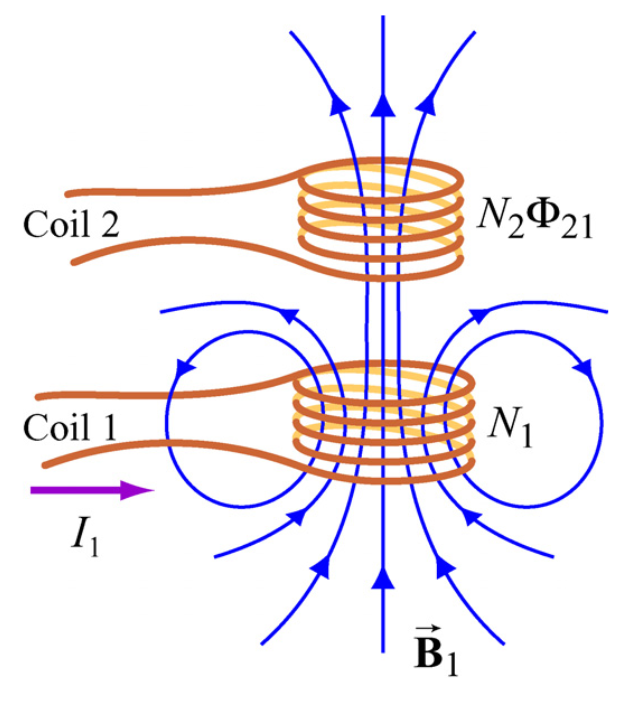

# Mutual Flux
Suppose two coils are placed near each
other, as in:

The first coil is excited with sinusoidal excitation and creates a magnetic field that also links Coil#2. Let \\(\Phi_{21}\\) is the magnetic flux that links coil #2. As, the I is varying with time, there will be an induced emf in Coil#2:

$$ V_{21} = - N_2 \frac{d \Phi_{21}}{dt}$$

The flux linkage in Coil#2 is proportional to current in Coil#1. Thus, let's define the mutual inductance (\\(M_{21}\\)) as:

$$ N_2 \frac{d\Phi_{21}}{dt} = M_{21} \frac{dI_1}{dt} $$

Mutual inductance can also be defined as:

$$M_{21}=\frac{N_2 \Phi_{21}}{I_1}$$

Special Case: For linear system (e.g. air)

$$\Phi_{21} = \frac{N_1 I_1}{\mathrm{R}}$$

where \\(\mathrm{R}\\) is the reluctance for the flux path. Mutual inductance  becomes:

$$M = \frac{N_1 N_2}{\mathrm{R}}$$
