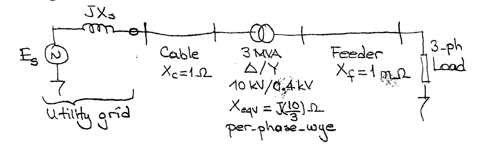

# 3phase Transformers

### Example:

Three single-phase 1 MVA 10 kV/230 V, 50 Hz transformers are connected in \\(\Delta-Y\\) to form a three-phase transformer bank. Determine,

- a) Turns-ratio
- b) Line-to-line voltage ratio
- c) Power Rating

Assume the total leakage reactance of each-single phase transformer referred to HV-side is \\(X\_{eq}= x_1 + x_2' = 10~\Omega\\)

Construct single-phase equivalent circuit of the 3-phase transformer bank

- d) on per phase-delta basis
- e) on per-phase Y basis

Suppose that primary and secondary leakage reactances (actual values) of each single-phase transformer are given as:
\\(X\_{1}= j 5 ~\Omega\\)

\\(X\_{2}= j 2.65 \times 10^{-3} ~\Omega\\)

- f) Repeat d-e
- g) Single-line diagram of a power system is given below

Obtain the single-phase equivalent circuit of the above system on the HV side (use per-phase-Wye basis).
---

a) \\(n=\frac{N\_1}{N\_2}=\frac{V\_{1-phase}}{V\_{2-phase}}=\frac{10000}{230}=43.5\\)

b) \\(\frac{V\_{1-line-to-line}}{V\_{2-line-to-line}}=\frac{10000}{230\sqrt{3}}=25\\)

c) Power Rating = 3 x 1 MVA = 3 MVA

