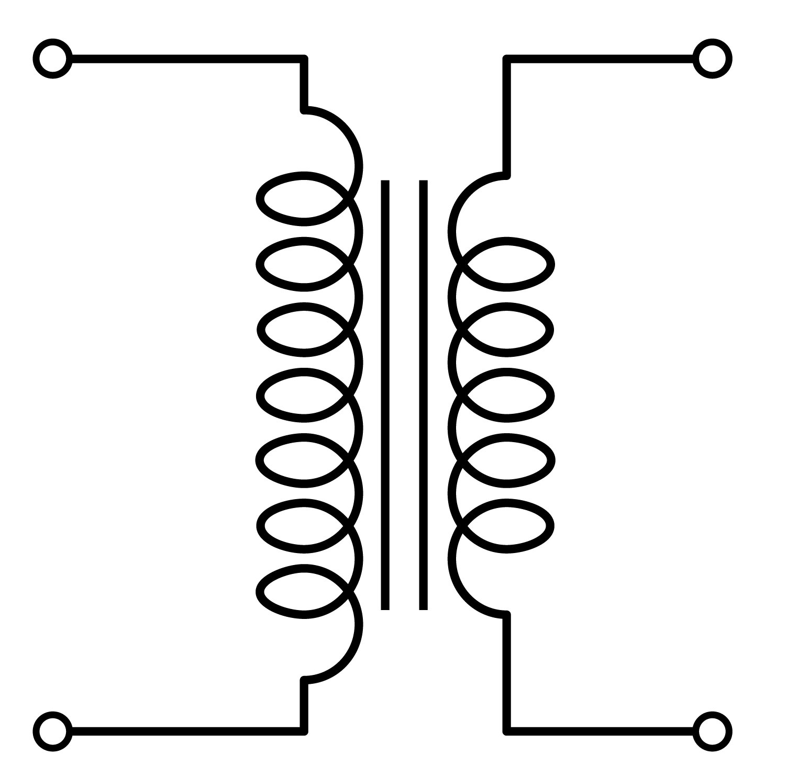

# Practical Transformer

We covered the ideal transformer in the previous section. We made lots of assumptions to simplify the transformer to an ideal unit that steps-down or steps-up the applied AC voltage:

However, we need to consider other parameters to obtain a more realistic representation:

- Coil Resistance: The resistance of the copper used in the primary and secondary winding is non-zero. The resistance is proportional to the length of the wire, hence to the number of turns.
- Some of the flux in the primary winding does not link the magnetic core and the secondary winding. This component is called the leakage flux.
- The permeability of the core is not infinite, thus there is some current (MMF) required to magnetize the core, which is called the magnetization current.
- The transformer core has a hysterisis B-H curve, which results in hysteresis loss. On top of that, there are eddy-current losses in the core. These two terms are shown with a resistive element in the equivalent circuit.

Thus, the actual transformer can be represented using an **ideal transformer plus external resistances and impedances**.

Equivalent circuit of an actual transformer:

#### Components:
* Winding Resistances (\\(R_1 \; R_2 \\)): This is the resistance of the copper used in the primary and secondary winding.
* Leakage Reactance (\\(X_{l}\\)): This component represents the amount of flux that doesn't link the primary and secondary winding. In a good transformer design, this should be as small as possible.
* Magnetizing Reactance (\\(X_{m}\\)): The current passes through this element represents the magnetizing current. (i.e. the H value in the operating B value).
* Core Loss Resistance (\\(Rcore\\)): This component represent the losses occur in the transformer core (i.e. hysteresis and eddy current losses).

## Simplification of the Equivalent Circuit

#### 1. Transfer secondary side parameters to the primary side

When referring the parameters they should be multiplied by the square of the turns ratio.

#### 2. Move parallel branch to the source side

As the values of \\(R_1\\) and \\(X_l\\) is very small compared to \\(R_c\\) and \\(X_m\\). The voltage drop on the \\(R_1\\) and \\(X_l\\) can be neglected, and the parallel branch can be moved to the source side for simpler calculations.

#### 3. Combine Primary and Secondary Series Components

## Solved Problems
Solved problems on transformers.
* [EMU-Eeng350](http://faraday.ee.emu.edu.tr/eeng350/Lecture%20Notes/Solved%20Problems%20Ch2.doc)
* [UNLV-EE340](http://www.egr.unlv.edu/~eebag/Chap%203%20Solutions.pdf)
* [MSU-ECE320](http://www.egr.msu.edu/~fzpeng/ECE320/ECE320-HW3-Solution.pdf)
* [HBCC-EE360](http://www.hbcc.edu.sa/facpages/Dr.AhsanulAlam/datafiles/Lecture%20Notes/EE%20360/Lecture_5_Nonideal%20Transformer.pdf)
