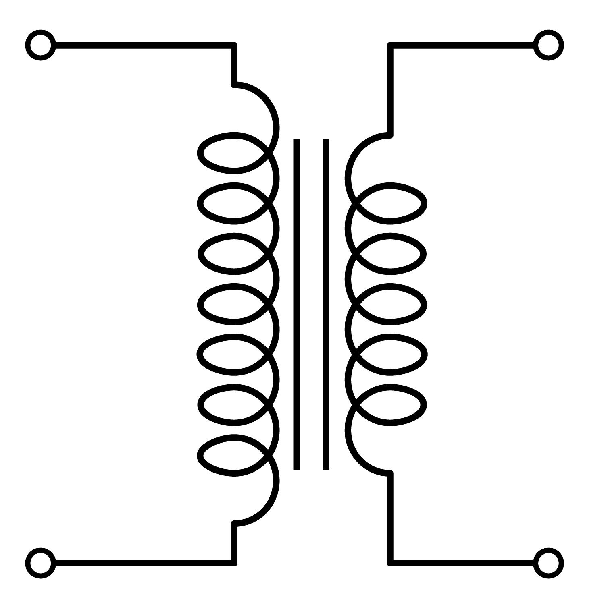

# Ideal Transformer

Although it is non-realistic let's assume an idealistic transformer with the following assumptions:

- The resistance of the coil is zero
- The core of the transformer is highly permeable (no MMF required to setup flux).
- No leakage flux (all the flux links the secondary coil)
- No eddy current or hystereris loss.
- Interwinding capacitance effects are neglected.

The induced voltage in coil#1 (primary winding) can be expressed as:

$$e_1 = N_1 \frac{d\Phi}{dt}$$

Similarly, the induced emf in Coil#2 (secondary winding)is:

$$e_2 = N_2 \frac{d\Phi}{dt}$$

As we assumed, there is no leakage flux, the flux linking both of the coils are equal, thus:

$$\frac{V_1}{V_2} = \frac{e_1}{e_2} = \frac{N_1}{N_2}$$

which implies; **the higher the number of turns the higher the induced voltage**.

The ratio of the currents are **inversely proportional** to turns ratio. There are two ways to verify this:

Firstly, we assumed there are no losses in the transformers, so **the input power should be equal to the output power**.

$$P_{in} = P_{out}$$

$$ V_1 I_1 = V_2 I_2$$

$$\frac{V_1}{V_2} = \frac{I_2}{I_1}$$

From above, we already showed that the ratio of number of turns is equal to the ratio of the induced voltages. Thus;

$$\frac{N_1}{N_2} = \frac{I_2}{I_1}$$
$$N_1 I_1 =N_2 I_2$$

The same relation can be obtained from the magnetic circuit. As the permeaability of the core is assumed to be infinite, the magnetic voltage drop is zero (H=0) in the core. Thus, the primary and secondary MMF should be equal:

$$\mathrm{F_1}=\mathrm{F_2}$$
$$N_1 I_1 =N_2 I_2$$

### Transformer ratio
The ratio of primary to secondary number of turns is called a-ratio or transformation ratio

$$a = \frac{N_1}{N_2}$$

Sometimes it is showed as a:1 (e.g. 15:1, 1:10 transformer). \\(a > 1\\) for step-down transformers, \\(a < 1 \\) for step-up transformers.

### Schematic

Ideal transformer are represented with the following symbol:

Dots are used to represent the polarity of the transformer:

Dots on the same side represent, the primary and secondary voltages are in-phase. Dots in the opposite side represent there is a 180 degree shift between primary and secondary.

###Ideal Transformer with Load

Consider the previous figure. A load (\\(Z_L\\)) is connected to the transformers secondary winding. The power in the load can be expressed as:

$$P_L = V_S I_S$$

The impedance of the load can be expressed as:
$$Z_L = \frac{V_S}{I_S}$$

If we put the transformer and load in a black box, for the primary voltage source, the equivalent impedance of the circuit is the ratio of primary voltage to primary current.

$$Z_P = \frac{V_P}{I_P}$$

which can be expressed using secondary voltage and current as follows:

$$Z_P = \frac{\frac{N_P}{N_S}V_P}{I_S \frac{N_S}{N_P}}$$

$$Z_P =\left( \frac{N_P}{N_S}\right)^2 Z_S $$

Or using "1" for primary substution and "2" for secondary:

$$Z_1 =\left( \frac{N_1}{N_2}\right)^2 Z_2 $$

### Transformations between primary and secondary:
Assume the transformer ratio is \\(a\\) (i.e. a:1):

#### From Secondary to Primary Winding
| Referred to Primary | Actual Value |
| -- | -- |
| \\(V_2' = a V_2\\) | \\(V_2\\) |
| \\(I_2' = I_2/a \\) | \\(I_2\\) |
| \\(Z_2' = a^2 Z_2\\) | \\(Z_2\\) |

#### From Primary to Secondary Winding

| Actual Value | Referred to Secondary|
| -- | -- |
| \\(V_1\\) | \\(V_1' = V_1 / a\\) |
| \\(I_1\\) | \\(I_1' = a I_1 \\) |
| \\(Z_1\\) | \\(Z_1' = Z_1 / a^2\\) |
