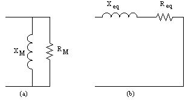

# No-Load & Short-Circuit Tests

Simplified equivalent circuits for:

a) No-load test
b) Short-circuit test

# Voltage Regulation

#### Exercise:
A 1000 VA 230/115 V transformer has been tested to determine its equivalent circuit. The results of the tests are:

| Open-Circuit Test | Short-Circuit Test |
| -- | -- |
| Voc = 230 V | Vsc = 13.2 V |
| Ioc = 0.45 A | Isc = 6.0 A |
| Poc = 30 W | Psc = 20.1 W |

All the data were taken from the primary side of the transformer.

a) Find the equivalent circuit of the transformer:

**Open Circuit Test:**

At open-circuit load current (\\( I_L \\)) is zero. Thus, only the parallel branch is active.

Power at no load just dissipates in the core loss component (\\(R_{core}\\)):

$$P_{oc}=\frac{V_{oc}^2}{R_{core}}$$

$$R_{core} = \frac{230^2}{30} = 1763~ \Omega$$

Magnetizing inductance (\\(X_m\\)):

Method A:
Use complex power(S), real power (P), imaginary power (Q).
$$S = V I = 230~0.45 = 103.5~\mathrm{VA}$$
$$S=\sqrt{Q^2 + P^2}$$
$$Q =\sqrt{S^2 - P^2} = \sqrt{103.5^2 - 30^2} = 99~\mathrm{VAR} $$

$$Q = \frac{V_{oc}^2}{X_m}$$
$$X_m = \frac{V_{oc}^2}{Q}= \frac{230^2}{99} = 534.3~\Omega$$

Method B:
Use the equivalent impedance of the parallel branch.

$$|Z_{core}|= \frac{V_{oc}}{I_{oc}}=\frac{230}{0.45}=511 \Omega$$

$$Z_{core}=R_{core} // jX_m$$
$$|Z_{core}|= |( \frac{1}{R_{core}} + \frac{1}{jX_m})^{-1}|$$

$$X_m = 534.3 \Omega$$

**Short Circuit Test:**
In the short-circuit test, applied voltage is very small, thus the power dissipation in the parallel branch can be neglected.

Series equivalent resistance and impedance can be calculated from the short circuit test.

Power in the short circuit dissipates from the equivalent copper resistance (\\(R_{eq}\\)).

$$P_{sc}=I_{sc}^2 R_{eq}$$
$$R_{eq}=\frac{20.1}{6^2}=0.558~\Omega$$

Equivalent impedance is the series of equivalent copper resistance and leakage inductance.

$$Z_{eq}=R_{eq}+jX_{eq}$$
$$|Z_{eq}|=\frac{V_{sc}}{I_{sc}}=\frac{13.2}{6}=2.2~\Omega$$
$$|Z_{eq}|=\sqrt{R_{eq}^2+X_{eq}^2}$$
$$X_{eq}=\sqrt{2.2^2-0.558^2}=2.13~\Omega$$

$$R_{c}=1763~\Omega \quad X_{m}=534.3~\Omega\quad R_{eq}=0.558~\Omega\quad
X_{eq}=2.13~\Omega\quad$$
