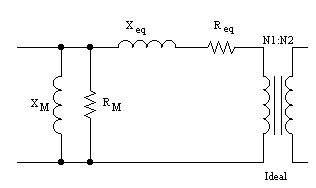
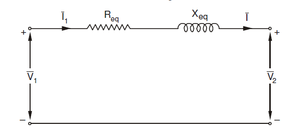

#Voltage Regulation

Voltage Regulation is a  transformer's ability to keep output voltage constant.

Ideal transformer has the same output voltage level at full load and at no load. However, practical transformers output voltage varies according the load current and power factor.

$$V_{reg}=\frac{V_2(No\;Load)-V_2(Full\;Load)}{V_2(No\;Load)}$$

A smaller voltage regulation means a better design for a power transformer.

A capacitive load can result in negative voltage regulation.

---
#### Example:
For the same transformer(1000 VA) used in the no-load, short-circuit tests, calculate the voltage regulation when:

- a) 0.8 pf lagging rated current
- b) 1.0 pf rated current
- c) 0.8 pf leading rated current

at the secondary side, if the output voltage is 115 V at the specified load condition. Neglect the parallel branch.

Equivalent circuit of the transformer is:

$$R_{c}=1763~\Omega \quad X_{m}=534.3~\Omega\quad R_{eq}=0.558~\Omega\quad
X_{eq}=2.13~\Omega\quad$$

The parallel branch is neglected and the equivalent circuit becomes:

The series branch elements are moved to the secondary side:
$$R_{eq}=0.140~\Omega\quad
X_{eq}=0.532~\Omega\quad$$

$$\vec{V_1'}=\vec{V_2}+(R_{eq}+jX_{eq})\vec{I_2}$$

When the machine operates at rated load:
$$I_{rated}=\frac{S_{rated}}{V_{rated}}=\frac{1000}{115}=8.7~A$$

**a) 0.8 pf lagging rated current:**
$$\vec{V_1'}=\vec{V_2}+(R_{eq}+jX_{eq})\vec{I_2}$$
$$\vec{V_1'}=115 \angle 0-(0.140+j0.532)8.7\angle{-37}=118.8\angle 1.4$$
At no load the current will be zero, so the secondary side voltage will be equal to 118.8 V, dropping to 115V at full load

$$V_{reg}=\frac{V_2(No\;Load)-V_2(Full\;Load)}{V_2(Full\;Load)}$$
$$V_{reg}=\frac{118.8-115}{115}=3.3\%$$

**b) 1.0 pf resistive rated current:**

$$\vec{V_1'}=115 \angle 0-(0.140+j0.532)8.7\angle{0}=116.3\angle 2.28$$

$$V_{reg}=\frac{116.3-115}{115}=1.06\%$$

**c) 0.8 pf leading rated current:**

$$\vec{V_1'}=115 \angle 0-(0.140+j0.532)8.7\angle{37}=113\angle 2.24$$

$$V_{reg}=\frac{113-115}{115}=-1.5\%$$

with capacitive load negative voltage regulation is achieved. The secondary side voltage magnitude increases with increasing load!
